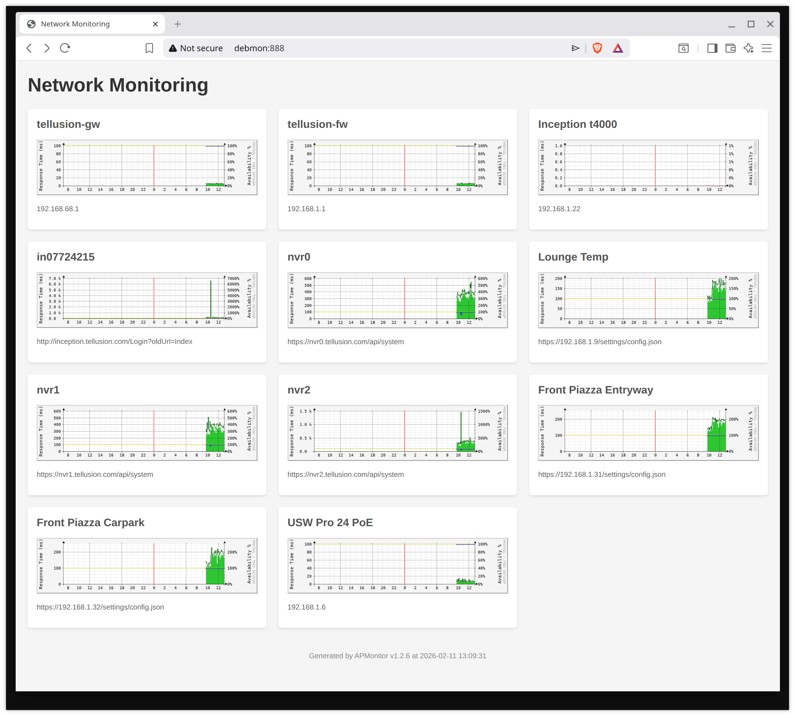

# `APMonitor.py` - A Hands-Off Layer 2 & 4 On-Premises Monitoring Tool with Alert Delivery Guarantees

This is an on-prem monitoring tool written completely in very clear Python-only code (so you can modify it) and is designed to work on a LAN for on-prem availability monitoring of resources that aren't necesarilly connected to The Internet, and/or where the on-prem monitoring itself is also required to have availability guarantees.

It is particularly suited to availability monitoring of embedded devices +/- 10 secs. It's designed primarily for firewalls, switches, routers, hubs, environmental sensors & #OT / #ICS systems, but works with normal servers &amp; services as well.

It supports multi-threading of the availability checking of monitored resources for high speed near-realtime performance, if that is what you need (see the `-t` command line option). The default operation mode is single-threaded for log clarity that runs on small systems like a Raspberry Pi.

It also supports pacing of monitoring alarms using a decaying curve that delivers alert notifications quickly at the start, then slows down notifications over time.

`APMonitor.py` (APMonitor) is primarily designed to work in tandem with [Site24x7](https://site24x7.com) and integrates very well with their "[Heartbeat Monitoring](https://www.site24x7.com/help/heartbeat/)".

To achieve **guaranteed always-on monitoring service levels**, simply setup local availability monitors in your config, [sign-up for a Pro Plan at Site24x7](https://www.site24x7.com/site24x7-pricing.html) then use `heartbeat_url` and `heartbeat_every_n_secs` configuration options to `APMonitor.py` to ping a [Heartbeat Monitoring](https://www.site24x7.com/help/heartbeat/) URL endpoint at [Site24x7](https://site24x7.com) when the monitored resource is up. This then ensures that when a heartbeat doesn't arrive from APMonitor, monitoring alerts fall back to Site24x7, and when both are working you have second-opinion availability monitoring reporting.

**The service level guarantee works as follows:** If the resource is down, `APMonitor.py` won't hit the [Heartbeat Monitoring](https://www.site24x7.com/help/heartbeat/) endpoint URL, and Site24x7 will then send an alert about the missed heartbeat without the need for any additional dependencies on-prem/on-site. So the entire machine `APMonitor.py` is running on can fall over, and you still get availability monitoring alerts sent, with all the benefits of having on-prem monitoring on your local network behind your firewall.  

You can quickly signup for a [Site24x7.com Lite or Pro Plan](https://www.site24x7.com/site24x7-pricing.html) for \$10-\$50 USD per month, then setup a bunch of [Heartbeat Monitoring](https://www.site24x7.com/help/heartbeat/) URL endpoints that works with `APMonitor.py` rather easily.

**Note: Heartbeat Monitoring is not available on their Website Monitoring plans. You need an 'Infrastructure Monitoring' or 'All-In-One' plan for it to work correctly.**

APMonitor also integrates well with [Slack](https://slack.com/) and [Pushover](https://pushover.net/) via webhook URL endpoints, and supports email notifications via SMTP.

APMonitor is a neat way to guarantee your on-prem availability monitoring will always let you know about an outage and to avoid putting resources onto the net that don't need to be.

<b>Andrew (AP) Prendergast</b><br />
https://linktr.ee/CompSciFutures<br />
Master of Science<br />

<i>Ex-ServerMasters<br/>
Ex-Googler<br />
Ex-Xerox PARC/PARK<br/>
Ex-Intel Foundry<br/>
Ex Chief Scientist @ Clemenger BBDO / Omnicom</i>

<i>[ACM](https://acm.org/), [IEEE](https://ieee.org) & [INFORMS](https://informs.org) member.</i>

[](https://buymeacoffee.com/compscifutures)


# Quickstart

To run APMonitor with a configuration file `test-apmonitor-config.yaml ` & auto-created statefile `/tmp/statefile.json`:
```
 ./APMonitor.py -vv -s /tmp/statefile.json test-apmonitor-config.yaml --generate-rrds 
```

# Design Philosophy &amp; Provenance

Once upon a time, I was well known in data center circles along Highway 101 in Silicon Valley for carrying in my back pocket a super lightweight pure C/libc cross-platform availability monitoring tool with no dependencies whatsoever called `APMonitor.c`. I'd graciously provide the source code to anyone who asked.

This is a rebuild of that project with enhanced features, starting with a Python prototype.

The design philosophy centers on simplicity and elegance: a single, unified source file containing the main execution flow for a 100% on-premises/LAN availability monitoring tool with guaranteed alerts and intelligent pacing.

Key Features:

- Near-realtime programming so heartbeats and alerts arrive when they say they are going to (+/- 10 secs)
- Multithreaded high-speed availability checking for PING, TCP, UDP, QUIC, HTTP(S), and SNMP resources
- SSL/TLS certificate checking and pinning so you can use self-signed certificates on-lan safely
- SNMP monitoring for network device interface bandwidth, I/O statistics, and TCP retransmit metrics
- Integration with Site24x7/PagerDuty heartbeat monitoring for high-availability second-opinion and failover alerting
- Integration with Slack and Pushover webhooks for notifications, plus standard email support
- Smart notification pacing: rapid alerts initially, then gradually decreasing frequency for extended outages
- Runs on everything from Raspberry Pi to enterprise systems
- Super accurate, high-frequency monitoring for real-time / embedded / heartbeat monitored environments
- Thread-safe, reentrant, and easily modifiable
- GPL 3.0 free open source always, so you know there are no backdoors

## Relevance to the 12 Pillars of Information Security

NB: This tool is useful for implementing the second &amp; third pillars (Availability &amp; System Integrity)
from the 12 Pillars of Information Security, for Necessary, Sufficient & Complete Security: 


Also be mindful of the Attack Surface Kill-Switch Riddle:


See DOI [10.13140/RG.2.2.12609.84321](https://doi.org/10.13140/RG.2.2.12609.84321) for more information.

## Alternatives

If lightweight or realtime guarantees aren't important to you, and you want something more feature packed, 
consider these on-prem alternatives:

- Uptime Kuma
- Statping
- UptimeRobot

APMonitor is simple, minimalist, elegant and lightweight and comes from a reliable line of heritage so you can spin 
it up fast as a 2nd opinion monitoring tool with little more than a `make install`. If you want something more 
sophisticated that's less focused on realtime programming or elegant simplicity, take a look at those very capable
alternatives.

# Recommended configuration for real-time environments

To put APMonitor into near-realtime mode so that it checks resources multiple times per second, use these global settings:

- Dial up threads with `-t 15` on the command line or `max_threads: 15` in the site config,
- set `max_retries` to `1` and
- dial down `max_try_secs` to `10` or `15` seconds

for real-time environments.

# Recommended configuration of Site24x7 Heartbeat Monitor Thresholds for HA Availability Monitoring

You do need to configure Site24x7's Hearbeat Monitoring to achieve high-availability second opinion availability monitoring.

As an exemplar, for the following monitored resource:
```yaml
monitors:
  - type: http
    name: home-nas
    address: https://192.168.1.12/api/bump
    expect: "(C) COPYRIGHT 2005, Super NAS Storage Inc."
    ssl_fingerprint: a1b2c3d4e5f67890abcdef1234567890abcdef1234567890abcdef1234567890
    heartbeat_url: https://plus.site24x7.com/hb/your-unique-heartbeat-id/homenas
    heartbeat_every_n_secs: 300
```

Setup Site24x7 as follows:


This will send a heartbeat to [Site24x7](https://site24x7.com) every 5 minutes, and Site24x7 will drop an alarm whenever a heartbeat 
doesn't arrive or arrives out of sequence +/- 1 minute (i.e., if the heartbeat doesn't arrive or is > 60 seconds out).
This ensures availability monitoring will always function, even when one of APMonitor or Site24x7 is down. 

This also means you don't need to expose internal LAN network resources to The Internets.

APMonitor's near-realtime capabilities will deliver heartbeats +/- 10 secs, so if you want high-precision alerts
drop an alarm if a heartbeat does not arrive bang on 5 minutes apart +/- 10 secs. 

To see the accuracy, configure Site24x7 as follows:


Site24x7 will record the error in their dashboard for anything that is more than +/- 1000 ms out, 
so you can keep a record of how accurate the near-realtime heartbeat timing is.

See Site24x7 docs for more info:
- [Heartbeat Monitoring](https://www.site24x7.com/help/heartbeat/)
- [Thresholds configuration](https://www.site24x7.com/help/admin/configuration-profiles/threshold-and-availability/server-monitor.html)

NB: "+/- 10 secs" means your errors should be measurable in 10ths of a minute. Once Mercator Queues are added, this will
drop down to "+/- 1 sec" or possibly "+/- 100 ms", depending on how well Python performs with high-speed realtime
programming. A workaround in the meantime is to make sure your number of threads is equal to the number of monitored
resources - something that is not necessarily practical or required in most settings.


# Recommended configuration for 'Hands-Off' alarm notification pacing

If you want to avoid the need to connect to the monitoring server to hush alarms as they happen and ensure you receive
UP notifications as soon as things return to normal, you might also want to consider alarm notification pacing, so that
recently down resources generate more frequent messages, whilst long outages are notified less frequently. To enable:

- Set `notify_every_n_secs` to `3600` seconds (i.e., 1 hour), and
- Set `after_every_n_notifications` to `8`,

which will slow alarms down to one per hour after 8 notifications.

An alternate config for monitored resources that have long outages is as follows:

- Set `notify_every_n_secs` to `43200` (i.e., 12 hours), and
- Set `after_every_n_notifications` to `6`,

which will slow alarms down to one every 12 hours after 6 notifications, which means after a few days you will only get at most one alarm whilst asleep.

To see how the alarm pacing will accelerate then subsequently delay notifications, use the example calculations spreadsheet in  [20151122 Reminder Timing with Quadratic Bezier Curve.xlsx](devnotes/20151122%20Reminder%20Timing%20with%20Quadratic%20Bezier%20Curve.xlsx) to experiment with various configuration scenarios:


Note that alarm pacing can be set at a global level in the `site:` config, and is overridden when set at a per monitored resource level in the `monitors:` section of the config.

# MRTG/RRD Integration for Performance Graphing

APMonitor integrates with MRTG (Multi Router Traffic Grapher) and RRDtool to provide historical performance graphs of resource availability and response times. This integration enables trend analysis, capacity planning, and visual monitoring dashboards.

## Quick Start

Install MRTG and related dependencies:
```bash
sudo make installmrtg
```

This installs nginx on port 888, fcgiwrap for CGI support, and sets up the MRTG web interface.

Enable RRD data collection by running APMonitor with `--generate-mrtg-config`:
```bash
./APMonitor.py -vv -s /var/tmp/apmonitor-statefile.json config.yaml --generate-mrtg-config
```

Access graphs at `http://localhost:888/` or `http://<your-ip>:888/`.

## How It Works

When `--generate-mrtg-config` is specified:

1. **RRD Collection Enabled**: APMonitor records response times and availability status to RRDtool databases
2. **MRTG Config Generated**: Creates `.mrtg.cfg` file with monitor definitions
3. **Web Interface Updated**: Updates `mrtg-rrd.cgi.pl` and generates `index.html` with graph thumbnails
4. **Continuous Updates**: Subsequent runs update RRD files with latest metrics

**Output:**
- MRTG config: `{statefile-path}.mrtg.cfg` (e.g., `/var/tmp/apmonitor-statefile.mrtg.cfg`)
- RRD databases: 
  - Availability monitors: `{statefile-dir}/{statefile-name}.rrd/{monitor}-availability.rrd`
  - SNMP monitors: `{statefile-dir}/{statefile-name}.rrd/{monitor}-snmp.rrd`
- Web interface: `http://localhost:888/` (master index) and `http://localhost:888/mrtg-rrd/` (CGI interface)

## Command Options

Generate MRTG config with default working directory (`/var/www/html/mrtg`):
```bash
./APMonitor.py -s /var/tmp/statefile.json config.yaml --generate-mrtg-config
```

Specify custom working directory:
```bash
./APMonitor.py -s /var/tmp/statefile.json config.yaml --generate-mrtg-config /var/www/html/graphs
```

## RRD Data Collection

### Availability Monitors (ping, http, quic, tcp, udp)

Each availability monitor's RRD file tracks two metrics:

- **`response_time`** (GAUGE, milliseconds): Time taken for check to complete
  - Range: 0 to unlimited
  - Value: `U` (unknown) when check fails
  
- **`is_up`** (GAUGE, boolean): Service availability
  - `1` = service up
  - `0` = service down

### SNMP Monitors

SNMP monitors create RRD files with dynamic data sources based on discovered network interfaces:

- **Interface Traffic Counters** (COUNTER, bytes): Cumulative byte counters per interface
  - `{interface_name}_in`: Inbound bytes (IF-MIB::ifInOctets)
  - `{interface_name}_out`: Outbound bytes (IF-MIB::ifOutOctets)
  
- **TCP Retransmissions** (COUNTER, segments): TCP retransmit counter
  - `tcp_retrans`: Global TCP retransmission counter (TCP-MIB::tcpRetransSegs)

**SNMP Specifics:**
- Interface names are sanitized (alphanumeric + underscore, max 15 chars) to fit RRD's 19-character DS name limit
- COUNTER type automatically calculates rates (bytes/second) and handles 32/64-bit wraparound
- All interfaces for a device are stored in a single RRD file for atomic updates
- Interface list is discovered automatically via SNMP walk of IF-MIB::ifDescr table

### RRD Retention Policy (MRTG-compatible)

- High-resolution: 1 day at native check interval
- Short-term: ~2 days at 5-minute intervals (600 rows)
- Medium-term: ~12.5 days at 30-minute intervals (600 rows)
- Long-term: ~50 days at 2-hour intervals (600 rows)
- Historical: ~2 years at 1-day intervals (732 rows)

## Expected Output

Installing MRTG will spin up a web server with FastCGI on http://localhost:888/, as follows:



## Working with RRD Files Directly
```bash
# Query availability RRD database info
rrdtool info /var/tmp/apmonitor-statefile.rrd/monitor-name-availability.rrd

# Query SNMP RRD database info
rrdtool info /var/tmp/apmonitor-statefile.rrd/switch-snmp.rrd

# Run APMonitor with MRTG & RRD enabled
./APMonitor.py -vv -s /var/tmp/apmonitor.json test2-apmonitor-config.yaml --generate-mrtg-config

# Check when the RRD was created
ls -la /var/tmp/apmonitor.rrd/tellusion-gw-availability.rrd

# Dump RRD info to see its structure
rrdtool info /var/tmp/apmonitor.rrd/tellusion-gw-availability.rrd | head -50

# Check the last update timestamp
rrdtool lastupdate /var/tmp/apmonitor.rrd/tellusion-gw-availability.rrd

# Fetch the last 300 seconds
rrdtool fetch /var/tmp/apmonitor.rrd/tellusion-gw-availability.rrd AVERAGE -s end-300 -e now

# Fetch SNMP interface data
rrdtool fetch /var/tmp/apmonitor.rrd/switch-snmp.rrd AVERAGE -s end-3600 -e now

# Test the fetch command for one monitor
rrdtool fetch /var/tmp/apmonitor.rrd/tellusion-gw-availability.rrd AVERAGE -s end-300 -e now 2>/dev/null | grep -v nan | tail -1 | awk '{if (NF>=3) print int($2+0) ":" int($3+0); else print "0:0"}' | grep -E '^[0-9]+:[0-9]+$' || echo '0:0'
```

**References:**
- [MRTG-RRD Documentation](https://directory.fsf.org/wiki/Mrtg-rrd)
- [mrtg-rrd.cgi FAQ](https://web.archive.org/web/20081228131907/http://www.fi.muni.cz:80/~kas/mrtg-rrd/cvsweb.cgi/FAQ?rev=HEAD)

**Note:** RRD data collection is disabled by default. Run with `--generate-mrtg-config` once to enable, then continue normal monitoring to collect historical data.

# `APMonitor.py` YAML/JSON Site Configuration Options

APMonitor uses a YAML or JSON configuration file to define the site being monitored and the resources to check. The configuration consists of two main sections: site-level settings that apply globally, and per-monitor settings that define individual resources to check.

## Complete Example Configuration

Here's a complete example showing all available configuration options:
```yaml
site:
  name: "HomeLab"
  
  email_server:
    smtp_host: "smtp.gmail.com"
    smtp_port: 587
    smtp_username: "alerts@example.com"
    smtp_password: "app_password_here"
    from_address: "alerts@example.com"
    use_tls: true
  
  outage_emails:
    - email: "admin@example.com"
      email_outages: true
      email_recoveries: true
      email_reminders: true
    - email: "manager@example.com"
      email_outages: yes
      email_recoveries: yes
      email_reminders: no
  
  outage_webhooks:
    - endpoint_url: "https://api.pushover.net/1/messages.json"
      request_method: POST
      request_encoding: JSON
      request_prefix: "token=your_app_token&user=your_user_key&message="
      request_suffix: ""
  
  max_threads: 1
  max_retries: 3
  max_try_secs: 20
  check_every_n_secs: 60
  notify_every_n_secs: 600
  after_every_n_notifications: 1

monitors:
  # Switch port status monitoring with per-interface silence windows
  - type: ports
    name: office-switch
    address: "snmp://192.168.1.6"
    community: "public"
    check_every_n_secs: 30
    notify_every_n_secs: 3600
    after_every_n_notifications: 1

  # SNMP network device monitoring with 95th percentile graphing
  - type: snmp
    name: core-switch
    address: "snmp://192.168.1.1"
    community: "public"
    percentile: 95
    check_every_n_secs: 300
    heartbeat_url: "https://hc-ping.com/uuid-here"
    heartbeat_every_n_secs: 600

  # TCP port check with send/receive
  - type: tcp
    name: smtp-server
    address: "tcp://mail.example.com:25"
    send: "EHLO apmonitor\r\n"
    content_type: text
    expect: "250"
    check_every_n_secs: 60

  # TCP connection-only check
  - type: tcp
    name: mysql-db
    address: "tcp://192.168.1.100:3306"
    check_every_n_secs: 30

  # UDP send with hex data
  - type: udp
    name: custom-protocol
    address: "udp://192.168.1.200:9999"
    send: "01 02 03 04"
    content_type: hex
    expect: "OK"
    check_every_n_secs: 60
    
  # UDP send with text data
  - type: udp
    name: syslog-collector
    address: "udp://192.168.1.50:514"
    send: "<134>APMonitor: test message"
    check_every_n_secs: 300    
    
  - type: ping
    name: home-fw
    address: "192.168.1.1"
    check_every_n_secs: 60
    email: true
    heartbeat_url: "https://hc-ping.com/uuid-here"
    heartbeat_every_n_secs: 300

  - type: http
    name: in3245622
    address: "http://192.168.1.21/Login?oldUrl=Index"
    expect: "System Name: <b>HomeLab</b>"
    check_every_n_secs: 120
    notify_every_n_secs: 3600
    after_every_n_notifications: 5
    email: yes

  - type: http
    name: json-api
    address: "https://api.example.com/webhook"
    send: '{"event": "test", "status": "ok"}'
    content_type: "application/json"
    expect: "success"

  - type: http
    name: nvr0
    address: "https://192.168.1.12/api/system"
    expect: "nvr0"
    ssl_fingerprint: "a1b2c3d4e5f67890abcdef1234567890abcdef1234567890abcdef1234567890"
    ignore_ssl_expiry: true
    email: false
    heartbeat_url: "https://plus.site24x7.com/hb/uuid/nvr0"
    heartbeat_every_n_secs: 60

  - type: quic
    name: fast-api
    address: "https://192.168.1.50/api/health"
    expect: "ok"
    check_every_n_secs: 30
```

## site: configuration options

The `site` section defines global settings for the monitoring site.

### Required Fields

- **`name`** (string): The name of the site being monitored. Used in notification messages to identify which site is reporting issues.
```yaml
site:
  name: "HomeLab"
```

### Optional Fields

- **`email_server`** (object, optional): SMTP server configuration for sending email notifications. Required if `outage_emails` is configured.
```yaml
email_server:
  smtp_host: "smtp.gmail.com"
  smtp_port: 587
  smtp_username: "alerts@example.com"
  smtp_password: "app_password_here"
  from_address: "alerts@example.com"
  use_tls: true
```
  - **`smtp_host`** (string, required): SMTP server hostname or IP address
  - **`smtp_port`** (integer, required): SMTP server port (typically 587 for TLS, 465 for SSL, 25 for unencrypted). Must be between 1 and 65535
  - **`smtp_username`** (string, optional): SMTP authentication username. Not required for servers without authentication
  - **`smtp_password`** (string, optional): SMTP authentication password. Not required for servers without authentication. Use app-specific passwords for Gmail/Google Workspace
  - **`from_address`** (string, required): Email address to use in the "From" field. Must be a valid email address
  - **`use_tls`** (boolean, optional): Whether to use TLS/STARTTLS encryption. Default: true

**Note**: For Gmail/Google Workspace, you must use an [app-specific password](https://support.google.com/accounts/answer/185833) rather than your account password. Port 587 with `use_tls: true` is the recommended configuration for most SMTP servers. For servers without authentication (like local SMTP relays), omit `smtp_username` and `smtp_password`.

- **`outage_emails`** (list of objects, optional): Email addresses to notify when resources go down or recover. Requires `email_server` to be configured. Each entry is an object with an `email` field and optional notification control flags.
```yaml
outage_emails:
  - email: "admin@example.com"
    email_outages: true
    email_recoveries: true
    email_reminders: true
  - email: "oncall@example.com"
    email_outages: yes
    email_recoveries: no
```
  - **`email`** (string, required): Valid email address matching standard email format
  - **`email_outages`** (boolean/integer/string, optional): Send email when resource goes down. Accepts: `true`/`yes`/`on`/`1` (case-insensitive) for enabled, `false`/`no`/`off`/`0` for disabled. Default: true
  - **`email_recoveries`** (boolean/integer/string, optional): Send email when resource recovers. Accepts same values as `email_outages`. Default: true
  - **`email_reminders`** (boolean/integer/string, optional): Send email for ongoing outage reminders (respecting `notify_every_n_secs` throttling). Accepts same values as `email_outages`. Default: true

**Note**: These email control flags allow fine-grained control over which notifications each recipient receives. For example, operations staff might want all notifications (`email_outages: true`, `email_recoveries: true`, `email_reminders: true`), while management might only want initial outage alerts (`email_outages: true`, `email_recoveries: false`, `email_reminders: false`).

- **`outage_webhooks`** (list of objects, optional): Webhook endpoints to call when resources go down or recover. Each webhook requires several configuration fields.
```yaml
outage_webhooks:
  - endpoint_url: "https://api.example.com/alerts"
    request_method: POST
    request_encoding: JSON
    request_prefix: ""
    request_suffix: ""
```
  - **`endpoint_url`** (string, required): Valid URL with scheme and host for the webhook
  - **`request_method`** (string, required): HTTP method, must be `GET` or `POST`
  - **`request_encoding`** (string, required): Message encoding format:
    - `URL`: URL-encode the message (for query parameters or form data)
    - `HTML`: HTML-escape the message
    - `JSON`: Send as JSON object with `message` field (POST only)
    - `CSVQUOTED`: CSV-quote the message for comma-separated values
  - **`request_prefix`** (string, optional): String to prepend to encoded message (e.g., API tokens, field names)
  - **`request_suffix`** (string, optional): String to append to encoded message

- **`max_threads`** (integer, optional): Number of concurrent threads for checking resources in parallel. Must be ≥ 1. Default: 1 (single-threaded). Can be overridden by command line `-t` option.
```yaml
max_threads: 1
```

**Note**: For near-realtime monitoring environments, set `max_threads` to 5-15 to enable parallel checking of multiple resources. Single-threaded mode (1) is recommended for small systems like Raspberry Pi or when log clarity is important. This setting is overridden by the `-t` command line argument if specified.

- **`max_retries`** (integer, optional): Number of times to retry failed checks before marking resource as down. Must be ≥ 1. Default: 3
```yaml
max_retries: 3
```

**Note**: For near-realtime monitoring, set `max_retries: 1` to reduce detection latency. Higher values (3-5) are better for unstable networks where transient failures are common.

- **`max_try_secs`** (integer, optional): Timeout in seconds for each individual check attempt. Must be ≥ 1. Default: 20
```yaml
max_try_secs: 20
```

- **`check_every_n_secs`** (integer, optional): Default seconds between checks for all monitors. Individual monitors can override this with their own `check_every_n_secs` setting. Must be ≥ 1. Default: 60
```yaml
check_every_n_secs: 300
```

**Note**: This sets the baseline check interval for all monitors. Can be overridden per-monitor for resources requiring different check frequencies. When a monitor's configuration changes (detected via SHA-256 checksum), it is checked immediately regardless of this interval.

- **`notify_every_n_secs`** (integer, optional): Default minimum seconds between outage notifications for all monitors. Individual monitors can override this with their own `notify_every_n_secs` setting. Must be ≥ 1. Default: 600
```yaml
notify_every_n_secs: 1800
```

**Note**: This sets the baseline notification throttling interval. Combined with `after_every_n_notifications`, controls the notification escalation curve for all monitors unless overridden per-monitor.

- **`after_every_n_notifications`** (integer, optional): Default number of notifications after which the notification interval reaches `notify_every_n_secs` for all monitors. Individual monitors can override this with their own `after_every_n_notifications` setting. Must be ≥ 1. Default: 1 (constant notification intervals)
```yaml
after_every_n_notifications: 1
```

**Note**: When set to a value > 1, notification intervals start shorter and gradually increase following a quadratic Bezier curve until reaching `notify_every_n_secs` after the specified number of notifications. This provides more frequent alerts at the start of an outage when immediate attention is needed, then reduces notification frequency as the outage continues. A value of 1 maintains constant notification intervals (original behavior).

## monitors: configuration options

The `monitors` section is a list of resources to monitor. Each monitor defines what to check and how often.

### Required Fields (All Monitor Types)

- **`type`** (string): Type of check to perform. Must be one of:
  - `ping`: ICMP ping check
  - `http`: HTTP/HTTPS endpoint check (supports both HTTP and HTTPS schemes, follows and checks redirect chain for errors)
  - `quic`: HTTP/3 over QUIC endpoint check (UDP-based, faster than HTTP/HTTPS for high-latency networks)
  - `tcp`: TCP port connectivity and protocol check
  - `udp`: UDP datagram send/receive check
  - `snmp`: SNMP network device monitoring (interface bandwidth, TCP retransmits)
  - `ports`: SNMP switch port status monitor (tracks interface oper/admin state and MAC address changes with per-interface silence windows)

- **`name`** (string): Unique identifier for this monitor. Must be unique across all monitors in the configuration. Used in notifications and state tracking.

- **`address`** (string): Resource to check. Format depends on monitor type:
  - For `ping`: Valid hostname, IPv4, or IPv6 address
  - For `http`/`quic`: Full URL with scheme and host
  - For `tcp`: URL with `tcp://` scheme, hostname/IP, and port (e.g., `tcp://server.example.com:22`)
  - For `udp`: URL with `udp://` scheme, hostname/IP, and port (e.g., `udp://192.168.1.1:161`)
  - For `snmp`: URL with `snmp://` scheme and hostname/IP (e.g., `snmp://192.168.1.1` or `snmp://192.168.1.1:161`)
  - For `ports`: URL with `snmp://` scheme and hostname/IP — uses SNMP transport, same format as `snmp` (e.g., `snmp://192.168.1.6`)

### Optional Fields (All Monitor Types)

- **`check_every_n_secs`** (integer, optional): Seconds between checks for this resource. Overrides site-level `check_every_n_secs`. Must be ≥ 1. Default: 60 (or site-level setting if configured)
```yaml
check_every_n_secs: 300
```

**Note**: When a monitor's configuration changes (any field modification), the monitor is checked immediately on the next run regardless of this interval. Configuration changes are detected via SHA-256 checksum stored in the state file.

- **`notify_every_n_secs`** (integer, optional): Minimum seconds between outage notifications while resource remains down. Must be ≥ 1 and ≥ `check_every_n_secs`. Default: 600
```yaml
notify_every_n_secs: 1800
```

- **`after_every_n_notifications`** (integer, optional): Number of notifications after which the notification interval reaches `notify_every_n_secs` for this specific monitor. Overrides site-level `after_every_n_notifications`. Can only be specified if `notify_every_n_secs` is present. Must be ≥ 1.
```yaml
notify_every_n_secs: 3600
after_every_n_notifications: 5
```

**Behavior**: Notification timing follows a quadratic Bezier curve—intervals start shorter and gradually increase over the first N notifications until reaching the full `notify_every_n_secs` interval. After N notifications, the interval remains constant at `notify_every_n_secs`. This provides aggressive early alerting that tapers off as outages persist.

- **`email`** (boolean/integer/string, optional): Master switch to enable/disable email notifications for this specific monitor. Accepts: `true`/`yes`/`on`/`1` (case-insensitive) for enabled, `false`/`no`/`off`/`0` for disabled. Default: true (enabled if `email_server` configured)
```yaml
email: true
```

**Note**: When set to `false`, this monitor will not send any email notifications regardless of site-level `outage_emails` configuration. Useful for non-critical resources or during maintenance windows. This is a monitor-level override that takes precedence over all other email settings.

- **`heartbeat_url`** (string, optional): URL to ping (HTTP GET) when resource check succeeds. Useful for external monitoring services like Site24x7 or Healthchecks.io. Must be valid URL with scheme and host.
```yaml
heartbeat_url: "https://hc-ping.com/your-uuid-here"
```

- **`heartbeat_every_n_secs`** (integer, optional): Seconds between heartbeat pings. Must be ≥ 1. Can only be specified if `heartbeat_url` is present. If not specified, heartbeat is sent on every successful check.
```yaml
heartbeat_every_n_secs: 300
```

### HTTP/QUIC Monitor Specific Fields

These fields are only valid for monitors with `type: http` or `type: quic`:

- **`expect`** (string, optional): Substring that must appear in the HTTP response body for the check to succeed. If not present, any 200 OK response is considered successful. The check performs a simple string search—if the expected content appears anywhere in the response body, the check passes.
```yaml
expect: "System Name: <b>HomeLab</b>"
```

**Note**: The `expect` field is string-only for simplicity. It performs exact substring matching (case-sensitive). For complex validation scenarios requiring status code checks, header validation, or regex matching, consider using external monitoring tools or extending APMonitor.

- **`ssl_fingerprint`** (string, optional): SHA-256 fingerprint of the expected SSL/TLS certificate (with or without colons). Enables certificate pinning for self-signed certificates. When specified, the certificate is verified before making the HTTP request.
```yaml
ssl_fingerprint: "e85260e8f8e85629cfa4d023ea0ae8dd3ce8ccc0040b054a4753c2a5ab269296"
```

- **`ignore_ssl_expiry`** (boolean/integer/string, optional): Skip SSL/TLS certificate expiration checking. Accepts: `true`/`1`/`"yes"`/`"ok"` (case-insensitive) for true, or `false`/`0`/`"no"` for false. Useful for development environments or when certificate renewal is managed separately.
```yaml
ignore_ssl_expiry: true
```

### HTTP/QUIC POST Request Fields

These optional fields enable HTTP/QUIC monitors to send POST requests with data:

- **`send`** (string, optional): Data to send in HTTP/QUIC POST request body. When specified, the monitor sends a POST request instead of GET. Data is always UTF-8 encoded.
```yaml
send: '{"event": "test", "status": "ok"}'
```

- **`content_type`** (string, optional): MIME type for the Content-Type header. Can only be specified if `send` is present. This is a raw MIME type string (e.g., `application/json`, `application/x-www-form-urlencoded`, `text/plain`). Default: `text/plain; charset=utf-8`
```yaml
content_type: "application/json"
send: '{"event": "test", "status": "ok"}'
```

**HTTP JSON POST Example:**
```yaml
- type: http
  name: json-api
  address: "https://api.example.com/webhook"
  send: '{"event": "test", "status": "ok"}'
  content_type: "application/json"
  expect: "success"
```

**HTTP Form POST Example:**
```yaml
- type: http
  name: form-submit
  address: "https://example.com/submit"
  send: "name=test&value=123"
  content_type: "application/x-www-form-urlencoded"
  expect: "received"
```

**QUIC POST Example:**
```yaml
- type: quic
  name: text-endpoint
  address: "https://fast.example.com/log"
  send: "Test message"
  content_type: "text/plain; charset=utf-8"
```

**Note**: HTTP/QUIC monitors without `send` perform GET requests (original behavior). The `content_type` for HTTP/QUIC is a raw MIME type header, unlike TCP/UDP where it specifies encoding format (text/hex/base64).

### TCP/UDP Monitor Specific Fields

These fields are only valid for monitors with `type: tcp` or `type: udp`:

- **`send`** (string, optional for TCP, **required for UDP**): Data to send to the service. UDP monitors require this parameter because UDP is connectionless and needs application-layer data to verify connectivity.
```yaml
send: "EHLO apmonitor\r\n"
```

- **`content_type`** (string, optional): Encoding format for the `send` data. Can only be specified if `send` is present. Valid values:
  - `text` (default): UTF-8 encoded string
  - `hex`: Hexadecimal byte string (spaces and colons are stripped)
  - `base64`: Base64-encoded binary data
```yaml
content_type: hex
send: "01 02 03 04"
```

**Note**: TCP monitors without `send` perform connection-only checks. TCP monitors automatically attempt to receive data after connecting (useful for banner protocols like SSH, SMTP, FTP). UDP monitors without `expect` succeed if the packet is sent without socket errors, but cannot verify if the service is actually listening.

- **`expect`** (string, optional): Substring that must appear in the response for the check to succeed. For TCP, this validates the received banner or response. For UDP, this requires a matching response to be received.
```yaml
expect: "SSH-2.0"
```

**UDP Behavior Notes**:
- **With `expect`**: Real service validation (recommended for SNMP, DNS, NTP) - waits for response and validates content
- **Without `expect`**: Fire-and-forget (useful for syslog, statsd) - succeeds if packet sends without socket error, cannot detect if port is listening
- UDP is connectionless, so there's no "connection established" signal like TCP's three-way handshake

### SNMP Monitor Specific Fields

SNMP monitors poll network devices for interface statistics and TCP metrics using SNMPv2c. These monitors automatically discover all interfaces and collect bandwidth utilization data.

**Required Fields:**
- **`type`**: Must be `snmp`
- **`address`**: URL with `snmp://` scheme and hostname/IP (format: `snmp://[community@]hostname[:port]`)

**Optional Fields:**

- **`community`** (string, optional): SNMP community string for authentication. Default: `public`

- **`percentile`** (integer, optional): Percentile value to compute and display beneath each MRTG graph (e.g., `95` for 95th percentile billing). Must be an integer between 1 and 99. When specified, the Nth percentile is calculated over the graphed time range and shown in the stats table below each graph alongside Max/Average/Current.

  The 95th percentile is the standard metric for burstable bandwidth ("95th percentile billing"), which discards the top 5% of traffic samples to allow for short bursts without penalising peak usage in capacity planning.
```yaml
- type: snmp
  name: office-switch
  address: "snmp://192.168.1.6"
  community: "public"
  percentile: 95
  check_every_n_secs: 300
```

  **Note**: `percentile` is only valid for `snmp` monitors and has no effect unless `--generate-mrtg-config` is also used. The percentile is computed by `mrtg-rrd.cgi.pl` at graph render time via RRDtool's `VDEF PERCENT` consolidation function — it is not stored separately in the RRD.

**SNMP Address Format:**

The community string can be specified in three ways (in order of precedence):

1. **Monitor-level `community` field** (recommended for clarity):
```yaml
- type: snmp
  name: switch
  address: "snmp://192.168.1.6"
  community: "private"
```

2. **URL userinfo** (inline with address):
```yaml
- type: snmp
  name: switch
  address: "snmp://private@192.168.1.6"
```

3. **Default**: If neither is specified, defaults to `public`

**Monitored Metrics:**

SNMP monitors automatically poll these standard MIB objects:
- **IF-MIB::ifDescr** (1.3.6.1.2.1.2.2.1.2) - Interface descriptions
- **IF-MIB::ifInOctets** (1.3.6.1.2.1.2.2.1.10) - Bytes received per interface
- **IF-MIB::ifOutOctets** (1.3.6.1.2.1.2.2.1.16) - Bytes transmitted per interface
- **TCP-MIB::tcpRetransSegs** (1.3.6.1.2.1.6.12.0) - TCP retransmission segments (global counter)

**RRD Integration:**

When `--generate-mrtg-config` is specified, SNMP monitors create RRD files with dynamic data sources:
- **Filename**: `{statefile-dir}/{statefile-name}.rrd/{monitor-name}-snmp.rrd`
- **Data Sources**: One per discovered interface plus TCP retransmits
  - `{interface}_in` (COUNTER) - Inbound bytes
  - `{interface}_out` (COUNTER) - Outbound bytes
  - `tcp_retrans` (COUNTER) - TCP retransmissions

Interface names are sanitized to alphanumeric + underscore, truncated to 15 characters to fit RRD's 19-character DS name limit (leaving room for `_in`/`_out` suffix).

**SNMP Protocol Notes:**
- Uses SNMPv2c (community-based authentication)
- Port 161 is the standard SNMP port (can be overridden in address: `snmp://host:1161`)
- Performs SNMP walk to discover all interfaces automatically
- COUNTER data sources automatically calculate rates (bytes/second) from cumulative counters
- Handles 32-bit and 64-bit counter wraparound via RRDtool's COUNTER type
- All interfaces for a device are stored in a single RRD file for atomic updates

**Example SNMP Monitor Configuration:**
```yaml
- type: snmp
  name: core-switch
  address: "snmp://192.168.1.1:161"
  community: "monitoring"
  percentile: 95
  check_every_n_secs: 300
  heartbeat_url: "https://hc-ping.com/uuid-here"
  heartbeat_every_n_secs: 600
```

**Field Restrictions:**
- `expect`, `ssl_fingerprint`, `ignore_ssl_expiry` fields are not valid for SNMP monitors
- `send` and `content_type` fields are not valid for SNMP monitors
- `percentile` is not valid for non-SNMP monitor types
- SNMP monitors support `heartbeat_url` and `heartbeat_every_n_secs` like other monitor types

### Ports Monitor Specific Fields

The `ports` monitor type polls a managed network switch or router via SNMPv2c to track the operational and administrative status of every interface, and the set of learned MAC addresses on each port. It fires one notification per changed interface and enforces per-interface silence windows to suppress flap noise.

**Required Fields:**
- **`type`**: Must be `ports`
- **`address`**: URL with `snmp://` scheme and hostname/IP — same format as `snmp` monitors (e.g., `snmp://192.168.1.6`). Uses IF-MIB via SNMP transport.

**Optional Fields:**

- **`community`** (string, optional): SNMP community string. Default: `public`

- **`notify_every_n_secs`** / **`after_every_n_notifications`** (integers, optional): Control the per-interface silence window. Once an interface change fires a notification, further alerts for that interface are suppressed for `notify_every_n_secs × after_every_n_notifications` seconds. After the window expires, the baseline advances to the current interface state. Default values from site config apply.

**Silence Window Semantics:**

Each interface tracks its own silence window independently:

- **First poll**: establishes a silent baseline (no alerts, prints to stderr for diagnostics)
- **Change detected**: alert fires immediately, silence window opens for that interface only
- **During window**: baseline is held at the pre-change state; further state changes (including flap-back to original) are absorbed silently
- **Window expires**: baseline advances to current state regardless of intermediate flaps; new changes can trigger fresh alerts

This means if an interface flaps down then back up during the silence window, both events are suppressed and the window still runs its full duration — the baseline advances to whatever state the interface is in when the window expires.

**Monitored MIB Objects:**
- **IF-MIB::ifDescr** (1.3.6.1.2.1.2.2.1.2) — Interface name/description
- **IF-MIB::ifOperStatus** (1.3.6.1.2.1.2.2.1.8) — Operational status (`up`/`down`/`testing`/`unknown`/`dormant`/`notPresent`/`lowerLayerDown`)
- **IF-MIB::ifAdminStatus** (1.3.6.1.2.1.2.2.1.7) — Administrative status (`up`/`down`/`testing`)
- **Q-BRIDGE-MIB::dot1qTpFdbPort** (1.3.6.1.2.1.17.7.1.2.2.1.2) — Bridge port number per MAC (OID tail encodes `<vlan_id>.<6 MAC octets>`)
- **Q-BRIDGE-MIB::dot1qTpFdbStatus** (1.3.6.1.2.1.17.7.1.2.2.1.3) — MAC entry status; only `learned` (3) entries are tracked

**State Tracking:**

The state file stores one key per `ports` monitor:
- `ports_state`: committed baseline — dict of `{if_index: {name, oper, admin, macs}}` per interface; `macs` is a sorted list of learned MAC addresses in `AA:BB:CC:DD:EE:FF` format sourced from Q-BRIDGE-MIB; advances to current state on each successful poll

**Field Restrictions:**
- `expect`, `ssl_fingerprint`, `ignore_ssl_expiry` are not valid for `ports` monitors
- `send`, `content_type`, `percentile` are not valid for `ports` monitors
- `ports` monitors support `heartbeat_url` and `heartbeat_every_n_secs` like other monitor types
- RRD/MRTG graph generation is not supported for `ports` monitors (no numeric time-series metrics collected)

**Example Ports Monitor Configuration:**
```yaml
- type: ports
  name: office-switch
  address: "snmp://192.168.1.6"
  community: "public"
  check_every_n_secs: 30
  notify_every_n_secs: 3600
  after_every_n_notifications: 1
```

With the above config, the silence window is `3600 × 1 = 3600` seconds (1 hour). Once an interface change fires, that interface won't alert again for 1 hour regardless of further state changes.

**Sample Notification Output:**
```
##### PORT BASELINE: office-switch in HomeLab: GigabitEthernet0/1 oper=up admin=up #####
##### PORT CHANGE: office-switch in HomeLab: GigabitEthernet0/2 oper=down admin=up (was oper=up admin=up) at 2:15 PM #####
##### PORT CHANGE: office-switch in HomeLab: GigabitEthernet0/5 appeared oper=up admin=up at 2:15 PM #####
##### PORT CHANGE: office-switch in HomeLab: GigabitEthernet0/3 disappeared (was oper=up admin=up) at 2:15 PM #####
##### PORT MAC CHANGE: office-switch in HomeLab: GigabitEthernet0/1 MAC change appeared=[AA:BB:CC:DD:EE:FF] at 2:22 PM #####
##### PORT MAC CHANGE: office-switch in HomeLab: GigabitEthernet0/1 MAC change disappeared=[AA:BB:CC:DD:EE:FF] appeared=[11:22:33:44:55:66] at 2:25 PM #####
```

### Example Configurations

**Ping Monitor:**
```yaml
- type: ping
  name: home-gateway
  address: "192.168.1.1"
  check_every_n_secs: 60
  heartbeat_url: "https://hc-ping.com/uuid-here"
```

**HTTP Monitor with Content Check:**
```yaml
- type: http
  name: web-server
  address: "http://192.168.1.100/health"
  expect: "status: ok"
  check_every_n_secs: 120
  notify_every_n_secs: 3600
```

**HTTPS Monitor with Certificate Pinning:**
```yaml
- type: http
  name: nvr0
  address: "https://192.168.1.12/api/system"
  expect: "nvr0"
  ssl_fingerprint: "e85260e8f8e85629cfa4d023ea0ae8dd3ce8ccc0040b054a4753c2a5ab269296"
  ignore_ssl_expiry: true
  heartbeat_url: "https://plus.site24x7.com/hb/uuid/nvr0"
  heartbeat_every_n_secs: 60
```

**QUIC Monitor (HTTP/3):**
```yaml
- type: quic
  name: fast-api
  address: "https://api.example.com/health"
  expect: "healthy"
  check_every_n_secs: 30
  ssl_fingerprint: "a1b2c3d4e5f67890abcdef1234567890abcdef1234567890abcdef1234567890"
```

**Note**: QUIC monitoring uses HTTP/3 over UDP (port 443 by default) and is particularly effective for high-latency networks or when monitoring resources over unreliable connections. QUIC provides built-in connection migration and improved performance compared to TCP-based HTTP/2.

**TCP Banner Check (SSH):**
```yaml
- type: tcp
  name: ssh-server
  address: "tcp://server.example.com:22"
  expect: "SSH-2.0"
  check_every_n_secs: 60
```

**TCP Send/Receive (SMTP):**
```yaml
- type: tcp
  name: smtp-server
  address: "tcp://mail.example.com:25"
  send: "EHLO apmonitor\r\n"
  content_type: text
  expect: "250"
  check_every_n_secs: 60
```

**TCP Connection-Only Check:**
```yaml
- type: tcp
  name: mysql-db
  address: "tcp://192.168.1.100:3306"
  check_every_n_secs: 30
```

**UDP with Response Validation (DNS):**
```yaml
- type: udp
  name: dns-server
  address: "udp://8.8.8.8:53"
  send: "..." # DNS query packet
  content_type: hex
  expect: "..." # Expected response
  check_every_n_secs: 60
```

**UDP Fire-and-Forget (Syslog):**
```yaml
- type: udp
  name: syslog-collector
  address: "udp://192.168.1.50:514"
  send: "<134>APMonitor: test message"
  check_every_n_secs: 300
```

**SNMP Network Switch with 95th Percentile:**
```yaml
- type: snmp
  name: office-switch
  address: "snmp://192.168.1.6"
  community: "public"
  percentile: 95
  check_every_n_secs: 300
  heartbeat_url: "https://hc-ping.com/uuid-switch"
  heartbeat_every_n_secs: 600
```

**Switch Port Status Monitor:**
```yaml
- type: ports
  name: office-switch
  address: "snmp://192.168.1.6"
  community: "public"
  check_every_n_secs: 30
  notify_every_n_secs: 3600
  after_every_n_notifications: 1
```

### Validation Rules

The configuration validator enforces these rules:

1. Monitor names must be unique across all monitors
2. `notify_every_n_secs` must be ≥ `check_every_n_secs` if both specified
3. `heartbeat_every_n_secs` can only be specified if `heartbeat_url` exists
4. `expect`, `ssl_fingerprint`, and `ignore_ssl_expiry` are only valid for HTTP/QUIC monitors
5. `expect` must be a non-empty string if specified
6. All URLs must include both scheme (http/https/tcp/udp/snmp) and hostname
7. Email addresses must match standard email format (RFC 5322 simplified)
8. SSL fingerprints must be valid hexadecimal strings with length that's a power of two
9. `after_every_n_notifications` can only be specified if `notify_every_n_secs` is present
10. `outage_emails` can only be specified if `email_server` is configured
11. If `email_server` is present, `smtp_host`, `smtp_port`, and `from_address` are required
12. `smtp_username` and `smtp_password` are optional (for servers without authentication)
13. Email control flags (`email_outages`, `email_recoveries`, `email_reminders`) accept boolean or string values
14. Monitor-level `email` flag accepts boolean or string values
15. TCP monitors must use `tcp://` scheme, UDP monitors must use `udp://` scheme
16. TCP/UDP addresses must include hostname/IP and port
17. UDP monitors require `send` parameter
18. `content_type` can only be specified if `send` is present
19. `content_type` for TCP/UDP must be one of: text, hex, base64 (for HTTP/QUIC it's a raw MIME type string)
20. `ssl_fingerprint` and `ignore_ssl_expiry` are not allowed for TCP/UDP monitors
21. SNMP monitors must use `snmp://` scheme
22. `community` field is optional for SNMP monitors and must be a non-empty string if specified
23. `expect`, `ssl_fingerprint`, `ignore_ssl_expiry`, `send`, and `content_type` are not allowed for SNMP monitors
24. SNMP monitors support `heartbeat_url` and `heartbeat_every_n_secs` like other monitor types
25. `percentile` is only valid for SNMP monitors and must be an integer between 1 and 99
26. `ports` monitors must use `snmp://` scheme (SNMP transport)
27. `expect`, `ssl_fingerprint`, `ignore_ssl_expiry`, `send`, `content_type`, and `percentile` are not allowed for `ports` monitors
28. `ports` monitors support `heartbeat_url` and `heartbeat_every_n_secs` like other monitor types
29. `ports` monitors establish a silent baseline on first poll and alert on per-interface state changes thereafter

# Dependencies

Install system-wide for production use:
```
sudo apt install python3-rrdtool librrd-dev python3-dev mrtg rrdtool librrds-perl libsnmp-dev
sudo pip3 install PyYAML requests pyOpenSSL urllib3 aioquic rrdtool easysnmp
```

Or on Debian 12+ systems:
```
sudo apt install python3-rrdtool librrd-dev python3-dev mrtg rrdtool librrds-perl libsnmp-dev
sudo pip3 install --break-system-packages PyYAML requests pyOpenSSL urllib3 aioquic rrdtool easysnmp
```

**Note**: 
- The `aioquic` package is required for QUIC/HTTP3 monitoring support. If you don't plan to use `type: quic` monitors, you can omit this dependency.
- The `easysnmp` package and `libsnmp-dev` system library are required for SNMP monitoring support. If you don't plan to use `type: snmp` or `type: ports` monitors, you can omit these dependencies.

# Example invocation:
```
./APMonitor.py -s /tmp/statefile.json homelab-monitorhosts.yaml 
```
```
./APMonitor.py --test-webhooks -v homelab-monitorhosts.yaml 
```
```
./APMonitor.py --test-emails -v homelab-monitorhosts.yaml 
```

# Command Line Usage

APMonitor is invoked from the command line with various options to control verbosity, threading, state file location, and testing modes.

## Synopsis
```
./APMonitor.py [OPTIONS] <config_file>
```

## Command Line Options

- **`config_file`** (required): Path to YAML or JSON configuration file

- **`-v, --verbose`**: Increase verbosity level (can be repeated: `-v`, `-vv`, `-vvv`). Shows check progress, skip reasons, and diagnostic information. Useful for troubleshooting configuration or understanding monitoring behavior.

- **`-t, --threads <N>`**: Number of concurrent threads for checking resources (default: 1). Higher values enable parallel checking of multiple resources but increase lock contention. Use values > 1 for systems with many independent monitors. Will override the configuration file settings if `max_threads` is specified in the site config.

- **`-s, --statefile <path>`**: Path to state file for persistence (default: platform-dependent). **Recommended: use `/tmp/statefile.json`** to store state in tmpfs for better performance and reduced disk wear.

- **`--test-webhooks`**: Test webhook notifications by sending a dummy alert to all configured webhooks, then exit. Does not check resources or modify state file. Useful for verifying webhook configuration and credentials.

- **`--test-emails`**: Test email notifications by sending a dummy alert to all configured email addresses, then exit. Does not check resources or modify state file.

## Common Usage Examples

### Basic Monitoring (Single-Threaded)

Run with default settings, state stored in tmpfs:
```
./APMonitor.py -s /tmp/statefile.json monitoring-config.yaml
```

### Verbose Monitoring for Debugging

Show detailed progress and decision-making:
```
./APMonitor.py -v -s /tmp/statefile.json monitoring-config.yaml
```

### High-Frequency Monitoring (Multiple Threads)

Check many resources concurrently for near-realtime behavior:
```
./APMonitor.py -t 10 -s /tmp/statefile.json monitoring-config.yaml
```

Use higher thread counts (`-t 5` to `-t 20`) when:
- Monitoring many independent resources (50+)
- Resources have long check timeouts
- Near-realtime alerting is required
- System has sufficient CPU cores

**Warning**: High thread counts increase lock contention. Test with `-v` to ensure checks aren't blocking each other.

### Test Webhook Configuration

Verify webhooks are configured correctly before production use:
```
./APMonitor.py --test-webhooks -v monitoring-config.yaml
```

This sends test messages to all configured webhooks with verbose output showing request/response details.

### Test Email Configuration

Verify email settings work correctly:
```
./APMonitor.py --test-emails -v monitoring-config.yaml
```

## Running `APMonitor.py` Continuously

APMonitor is designed to be run repeatedly rather than as a long-running daemon. There are two common approaches:

### Option 1: Cron (Recommended for Most Cases)

Run every minute via cron for standard monitoring:
```
* * * * * /path/to/APMonitor.py -s /tmp/statefile.json /path/to/monitoring-config.yaml 2>&1 | logger -t apmonitor
```

NB: PID file locking should keep this under control, in case you get a long-running process.

**Advantages**:
- Automatic restart if process crashes
- Built-in scheduling
- System handles process lifecycle
- Easy to enable/disable (comment out cron entry)

**Best for**: Production systems, servers with standard monitoring requirements (check intervals ≥ 60 seconds)

### Option 2: While Loop (For Sub-Minute Monitoring)

Run continuously with short sleep intervals for near-realtime monitoring:
```
#!/bin/bash
while true; do
    ./APMonitor.py -t 5 -s /tmp/statefile.json monitoring-config.yaml
    sleep 10
done
```

Or as a one-liner:
```
while true; do ./APMonitor.py -s /tmp/statefile.json monitoring-config.yaml; sleep 30; done
```

**Advantages**:
- Sub-minute check intervals
- Near-realtime alerting
- Fine control over execution frequency

**Best for**: Development, testing, systems requiring rapid failure detection (check intervals < 60 seconds)

**Note**: Use short sleep intervals (5-30 seconds) combined with per-resource `check_every_n_secs` settings to balance responsiveness and system load. APMonitor's internal scheduling prevents redundant checks even with frequent invocations.

### Systemd Service (Alternative)

For production deployments requiring process supervision:
```
[Unit]
Description=APMonitor Network Resource Monitor
After=network.target

[Service]
Type=simple
ExecStart=/bin/bash -c 'while true; do /usr/local/bin/APMonitor.py -vv -s /var/tmp/apmonitor-statefile.json /usr/local/etc/apmonitor-config.yaml --generate-mrtg-config; sleep 10; done'
Restart=always
RestartSec=10
User=monitoring
StandardOutput=journal
StandardError=journal

[Install]
WantedBy=multi-user.target
```

## Default State File Location

APMonitor automatically selects a platform-appropriate default location for the state file if the `-s/--statefile` option is not specified:

### Linux, macOS, FreeBSD, OpenBSD, NetBSD
**Default**: `/var/tmp/apmonitor-statefile.json`

- Located in `/var/tmp` which persists across system reboots
- Preserves monitoring history and outage timestamps through restarts
- Enables accurate outage duration reporting even after system reboot
- No special permissions required (unlike `/var/run`)

### Windows
**Default**: `%TEMP%\apmonitor-statefile.json`

- Uses the system temporary directory defined by `TEMP` or `TMP` environment variables
- Typically resolves to `C:\Users\<username>\AppData\Local\Temp\apmonitor-statefile.json`
- Falls back to `C:\Temp\apmonitor-statefile.json` if environment variables are not set

### Unknown/Other Platforms
**Default**: `./apmonitor-statefile.json`

- Creates state file in current working directory
- Safe fallback for uncommon or embedded systems
- Avoids permission issues on unfamiliar filesystem layouts

### Concurrency and Multiple Instances

APMonitor's state file locking & PID locking is designed for **single-process concurrency only**—multiple threads within one process safely share state through internal locks. However, **no file-level locking** is implemented to coordinate between multiple APMonitor processes.

Having said that, APMonitor is very much re-entrant and thread safe for the most part, thus, if you specify different config files, it will happily allow a single process per config file to co-exist in parallel. 
The config filename is used as the hash when forming a PID lockfile in tempfs (`/tmp/apmonitor-##########.lock`), so that multiple lockfiles can coexist.

**Thus, running multiple concurrent instances requires separate state files**:
```
# Instance 1: Production monitoring
./APMonitor.py -s /var/tmp/apmonitor-prod.json prod-apmonitor-config.yaml

# Instance 2: Development monitoring
./APMonitor.py -s /var/tmp/apmonitor-dev.json dev-apmonitor-config.yaml

# Instance 3: Critical services (high-frequency)
./APMonitor.py -t 5 -s /tmp/apmonitor-critical.json critical-apmonitor-config.yaml
```

Which should mean sensible cardinality rules are enforced: one config per site, one process per config, one and IFF only one; good for running out of crontab. 

**Why separate state files are required**:
- No inter-process file locking mechanism exists
- Concurrent writes from multiple processes will corrupt state files
- Each process maintains independent monitoring schedules and notification state
- Atomic file rotation (`.new` → `.old`) only protects single-process integrity

**Use cases for multiple instances**:
- Different monitoring priorities (high-frequency critical vs. low-frequency non-critical)
- Separate environments (production, staging, development)
- Independent notification channels (ops team vs. dev team)
- Isolated failure domains (prevent one misconfigured monitor from blocking others)

### Override Behavior

Always specify `-s/--statefile` when:
- Running from cron (working directory may vary)
- Requiring tmpfs storage for performance (`-s /tmp/apmonitor-statefile.json`)
- Managing multiple independent monitoring instances
- Deploying in containers or restricted environments

**Example**: Force tmpfs storage (cleared on reboot, faster I/O):
```
./APMonitor.py -s /tmp/apmonitor-statefile.json apmonitor-config.yaml
```

**Note**: The `apmonitor-` prefix prevents naming collisions with other applications using generic `statefile.json` names.


# Developer Notes for modifying `APMonitor.py`

## State File

APMonitor uses a JSON state file to persist monitoring data across runs:

- **Location**: Recommended path is `/tmp/statefile.json` for tmpfs storage (faster, no disk wear)
- **Format**: JSON with per-resource nested objects containing timestamps, status, and counters
- **Atomic Updates**: Uses `.new` and `.old` rotation to prevent corruption on crashes
- **Thread Safety**: Protected by internal lock during concurrent access

The state file tracks:
- `is_up`: Current resource status
- `last_checked`: When resource was last checked (ISO 8601 timestamp)
- `last_response_time_ms`: Response time in milliseconds for successful checks
- `last_notified`: When last notification was sent (ISO 8601 timestamp)
- `last_alarm_started`: When current/last outage began (ISO 8601 timestamp)
- `last_successful_heartbeat`: When heartbeat URL last succeeded (ISO 8601 timestamp)
- `down_count`: Consecutive failed checks
- `notified_count`: Number of notifications sent for current outage
- `error_reason`: Last error message
- `last_config_checksum`: SHA-256 hash of monitor configuration (detects config changes)
- `ports_state`: (ports monitors only) committed baseline — dict of `{if_index: {name, oper, admin, macs}}` per interface; `macs` is a sorted list of learned MAC addresses in `AA:BB:CC:DD:EE:FF` format sourced from Q-BRIDGE-MIB; advances to current state on each successful poll


**Note**: If using `/tmp/statefile.json`, the state file is cleared on system reboot. This resets all monitoring history but doesn't affect functionality—monitoring resumes normally on first run.

**Configuration Change Detection**: The `last_config_checksum` field stores a SHA-256 hash of the entire monitor configuration (all fields including `type`, `name`, `address`, `expect`, etc.). When APMonitor detects a configuration change (checksum mismatch), it immediately checks that monitor regardless of `check_every_n_secs` timing. This ensures configuration changes take effect on the next run without waiting for the scheduled check interval.


## Execution Flow

Here are some basic devnotes on how APMonitor is built, in case you want to modify it.

Each invocation of APMonitor:

1. Acquires a PID lockfile via tempfs, using the config path as the hash to support multiple site configs in parallel. 
2. Loads and validates configuration file
3. Loads previous state from state file (if exists)
4. For each monitor:
   - Calculates SHA-256 checksum of monitor configuration
   - Checks if configuration changed (checksum mismatch) or `check_every_n_secs` elapsed since `last_checked`
   - If config changed: checks immediately (bypasses timing)
   - If due: performs resource check
   - If down and `notify_every_n_secs` elapsed: sends notifications
   - If up and heartbeat configured: pings heartbeat URL if due
   - Updates state atomically with new checksum
5. Saves state file with execution timing
6. Cleans up the PID file if possible.
7. Exits

This stateless design allows APMonitor to be killed/restarted safely at any time without losing monitoring history or creating duplicate notifications.

## Modifying with AI

APMonitor was designed with an engineering based approach to Vibe Coding in mind, should you wish to change it. 

Steps:

1. Paste in `READAI.md` (containing an Entrance Prompt) into your favourite AI coding tool (e.g., Grok 4.1 or Claude Sonnet)
2. Paste in `APMonitor.py` (tell your AI this is the source code)
3. Paste in `README.md` (tell your AI this is the documentation)
4. Vibe your changes as you see fit.

Enjoy!


# Installation Instructions - Debian Linux

This guide covers installing APMonitor as a systemd service on Debian-based systems (Debian 10+, Ubuntu 20.04+).

## Prerequisites

Fresh Debian/Ubuntu system with sudo access.


## Automated Install - Quickstart

If you want to do an automated install, just follow these instructions, otherwise start with **Step 1** below:
```
# Install (requires root)
sudo make install

# Edit configuration
sudo nano /usr/local/etc/apmonitor-config.yaml

# Test configuration
make test-config

# Enable and start service
sudo make enable

# Check status
make status

# View logs
make logs

# Restart after config changes
sudo make restart

# Uninstall completely
sudo make uninstall
```

## Step 1: Install System Dependencies
```
sudo apt update
sudo apt install python3 python3-pip libsnmp-dev -y
```

## Step 2: Install Python Dependencies

Install dependencies globally (required for systemd service):
```
sudo pip3 install --break-system-packages PyYAML requests pyOpenSSL urllib3 aioquic easysnmp
```

**Note**: On Debian 12+, the `--break-system-packages` flag is required. On older systems, omit this flag:
```
sudo pip3 install PyYAML requests pyOpenSSL urllib3 aioquic easysnmp
```

**Dependencies installed**:
- `PyYAML` - YAML configuration file parsing
- `requests` - HTTP/HTTPS resource checking and webhook notifications
- `pyOpenSSL` - SSL certificate verification and fingerprint checking
- `urllib3` - HTTP connection pooling (dependency of requests)
- `aioquic` - QUIC/HTTP3 protocol support (required for `type: quic` monitors)
- `easysnmp` - SNMP monitoring support (required for `type: snmp` and `type: ports` monitors)

## Step 3: Create Monitoring User

Create a dedicated system user for running APMonitor:
```
sudo useradd -r -s /bin/bash -d /var/lib/apmonitor -m monitoring
```

## Step 4: Install APMonitor

Copy the APMonitor script and example configuration to system locations:
```
# Install APMonitor script
sudo cp APMonitor.py /usr/local/bin/
sudo chmod +x /usr/local/bin/APMonitor.py

# Install example configuration
sudo cp example-apmonitor-config.yaml /usr/local/etc/apmonitor-config.yaml
sudo chown monitoring:monitoring /usr/local/etc/apmonitor-config.yaml
sudo chmod 640 /usr/local/etc/apmonitor-config.yaml
```

**Important**: Edit `/usr/local/etc/apmonitor-config.yaml` to configure your monitoring targets, notification endpoints, and site name before proceeding.

## Step 5: Create systemd Service

Create the systemd service definition:
```
sudo nano /etc/systemd/system/apmonitor.service
```

Paste the following content:
```
[Unit]
Description=APMonitor Network Resource Monitor
After=network.target

[Service]
Type=simple
ExecStart=/bin/bash -c 'while true; do /usr/local/bin/APMonitor.py -vv -s /var/tmp/apmonitor-statefile.json /usr/local/etc/apmonitor-config.yaml --generate-mrtg-config; sleep 10; done'
Restart=always
RestartSec=10
User=monitoring
StandardOutput=journal
StandardError=journal

[Install]
WantedBy=multi-user.target
```

Save and exit (Ctrl+X, then Y, then Enter in nano).

## Step 6: Enable and Start Service

Reload systemd, enable the service to start on boot, and start it:
```
sudo systemctl daemon-reload
sudo systemctl enable apmonitor.service
sudo systemctl start apmonitor.service
```

## Step 7: Verify Operation

Check service status:
```
sudo systemctl status apmonitor.service
```

View live logs:
```
sudo journalctl -u apmonitor.service -f
```

View recent logs:
```
sudo journalctl -u apmonitor.service -n 100
```

## Troubleshooting

### Test APMonitor Manually

Run APMonitor manually as the monitoring user to verify configuration:
```
sudo -u monitoring /usr/local/bin/APMonitor.py -vv -s /var/tmp/apmonitor-statefile.json /usr/local/etc/apmonitor-config.yaml
```

### Test Webhook Notifications

Test webhook configuration without checking resources:
```
sudo -u monitoring /usr/local/bin/APMonitor.py --test-webhooks -v /usr/local/etc/apmonitor-config.yaml
```

### Test Email Notifications

Test email configuration without checking resources:
```
sudo -u monitoring /usr/local/bin/APMonitor.py --test-emails -v /usr/local/etc/apmonitor-config.yaml
```

### Check State File Permissions

Verify the monitoring user can write to the state file location:
```
sudo ls -la /var/tmp/apmonitor-statefile.json
```

The `/var/tmp` directory should have permissions `1777` (drwxrwxrwt) allowing any user to create files.

### View Configuration

Display the active configuration:
```
sudo cat /usr/local/etc/apmonitor-config.yaml
```

### Service Management Commands
```
# Stop service
sudo systemctl stop apmonitor.service

# Restart service (after config changes)
sudo systemctl restart apmonitor.service

# Disable service from starting on boot
sudo systemctl disable apmonitor.service

# Check if service is enabled
sudo systemctl is-enabled apmonitor.service
```

## Updating Configuration

After modifying `/usr/local/etc/apmonitor-config.yaml`, the changes take effect automatically on the next monitoring cycle (typically within 30 seconds). APMonitor detects configuration changes via SHA-256 checksums and immediately checks any modified monitors, so you don't need to restart the service unless you want immediate effect.

To force immediate checking of all monitors after config changes:
```
sudo systemctl restart apmonitor.service
```

## Uninstallation

To completely remove APMonitor:
```
# Stop and disable service
sudo systemctl stop apmonitor.service
sudo systemctl disable apmonitor.service

# Remove service file
sudo rm /etc/systemd/system/apmonitor.service
sudo systemctl daemon-reload

# Remove files
sudo rm /usr/local/bin/APMonitor.py
sudo rm /usr/local/etc/apmonitor-config.yaml
sudo rm /var/tmp/apmonitor-statefile.json*

# Remove monitoring user
sudo userdel -r monitoring

# Optionally remove Python dependencies
sudo pip3 uninstall -y PyYAML requests pyOpenSSL urllib3 aioquic easysnmp
```

# TODO

- Add additional monitors:
  - ~~TCP & UDP port monitoring~~ (completed in v1.2.0)
  - ~~SNMP w/defaults for managed switches and system performance tuning~~ (completed in v1.2.5)
  - ~~Switch port status monitoring (`ports` type) with per-interface silence windows~~ (completed in v1.2.9)
  - ~~Add automated MAC address pinning to port status monitoring~~ (completed in v1.2.10)
  - Update docs to provide webhook examples for Pushover, Slack & Discord

- Add additional outputs: 
  - ~~MRTG compatible logfiles~~ (completed in v1.2.3)
  - ~~MRTG compatible graph generation w/index.html~~ (completed in v1.2.3)
  - Use loess regression on MRTG compatible logfiles for outlier & drop/increase detection

- Aggregated root cause alerting:
  - Specify parent dependencies using config option `parent_name` so we have a network topology graph
  - Add loop detection to ensure the topology graph is a DAG
  - Use the topology to only notify outages for the root cause and list the affected services in the same alert
  - When a monitored resource has multiple parent dependencies, specify if it's down when all are down (AND relation) or down when one is down (OR relation)
  - Consider correct use of pre/in/post-order traversal when deciding which alerts to drop

- Convert finished version to pure C `APMonitor.c` 
  - Strictly only with `libc`/SVR4 C Systems Programming dependencies for really tiny cross-platform embedded systems application environments 
  - Test if we are `root` when doing a `ping` syscall and fallback to direct `SOCK_RAW` if we are for high performance

- Add network segment monitoring for detecting new hosts with `nmap`.

- Add a Mercator + `APTree.c` `#InfoRec` inspired/styled priority queue for handling large numbers of monitored resources with proper realtime programming guarantees

- Do <i>Humanizing Data</i> [https://x.com/CompSciFutures/status/1930974323424321985](https://x.com/CompSciFutures/status/1930974323424321985) on MRTG+AP charts to show regime shifts and correlated sub-graphs over response times & SNMP stats<br /><br/>

  [](https://x.com/CompSciFutures/status/1930974323424321985)

# Licensing & Versioning

`APMonitor.py` is licensed by Andrew (AP) Prendergast <ap@andrewprendergast.com><br />
under the [GNU General Public License version 3](LICENSE.txt).

`mrtg-rrd.cgi.pl` is licensed by Jan "Yenya" Kasprzak <kas@fi.muni.cz><br />
under the [GNU General Public License version 2](https://www.gnu.org/licenses/old-licenses/gpl-2.0.html).
```
Software: APMonitor 1.2.11
License: GNU General Public License version 3
Licensor: Andrew (AP) Prendergast, ap@andrewprendergast.com -- FSF Member
```

We use [SemVer](http://semver.org/) for version numbering.

[](https://www.fsf.org/)